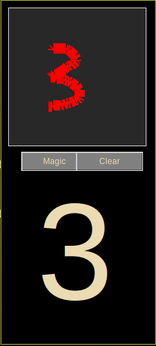
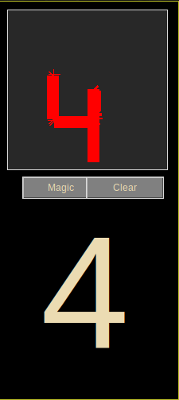
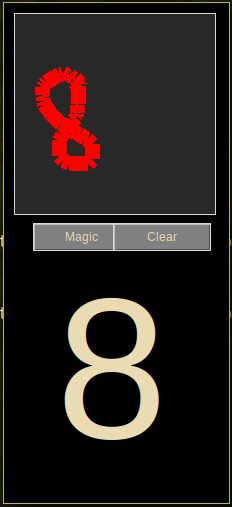

## chiffre recognition using back propagation and linear regression in python 

This project was part of IA course at ENSIAS, the task was to create a model that takes as input 32 parameters extracted from the chiffre, by dividing the picture into 16 blocks and in each block extract `a` and `b` ($y=ax+b$) using linear regression, for more information about this method : [the original research](https://pdfs.semanticscholar.org/ad9c/c74fac85ec0431d6bbcb8c63095539734a9c.pdf)

### extraction :

In a nutshell: to extract the features first I used `cv2` to crop the chiffre, then resize the picture to 28*28, then crop and extract values using polyfit from numpy.

### dataset :

I used the csv version of MNIST provided by [kaggle](https://www.kaggle.com/c/digit-recognizer)

To make the training faster I applied the extraction on all the training data and testing data and saved them into new csv files 
take a look at `data-to-csv` notebook for mode details

## model :

Details about the training and testing of the model is in the `IA-project` notebook

with the corrent configuration I managed to get 80% accuracy in the training and 91% in the testing

to make it easy to use, I saved the trained model in this file : `model-80-91`

## usage :

